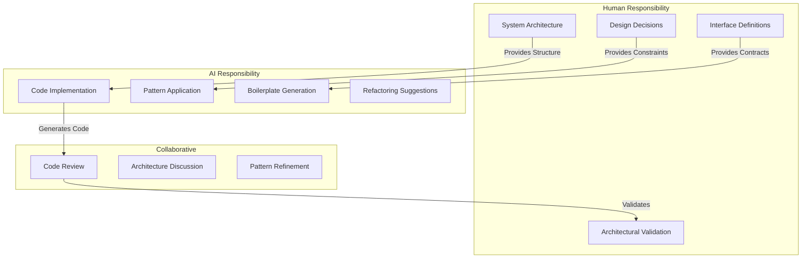

# AI-Facilitated Programming: The New Art of Software Design

> **⚠️ Work In Progress (WIP)** - This document is currently under development and may be incomplete or subject to change.

The emergence of AI coding assistants has not eliminated the need for good software design—it has elevated it. The question is no longer "Can we write code?" but "Can we design systems that AI can help us build, understand, and maintain?"

AI-facilitated programming transforms the developer from a code writer into a **system architect** and **design communicator**. The art lies in knowing what to ask, how to structure problems, and how to maintain architectural integrity when AI generates the implementation.

## 1. The New Golden Rules of AI-Assisted Development

### Rule 1: Design First, Generate Second

**Principle:** AI excels at implementation, but you must provide the architecture.

- **You Define:** The structure, interfaces, dependencies, and design patterns
- **AI Implements:** The concrete code within your architectural boundaries
- **You Validate:** That the generated code respects your design principles

**Anti-Pattern:** Asking AI to "build a game" without architectural guidance results in tightly-coupled, unmaintainable code.

**Best Practice:** Design the system architecture first, then use AI to implement individual components within that structure.

### Rule 2: Communicate Architecture, Not Just Requirements

**Principle:** AI needs context about your design decisions, not just what you want to build.

**What to Communicate:**

- **Dependency Structure:** "This controller depends on this interface, not the concrete implementation"
- **Design Patterns:** "Use the Passive View pattern—the View should not know about the Controller"
- **Architectural Principles:** "Follow the Onion Architecture—dependencies point inward"
- **Existing Patterns:** "Follow the same pattern as the InventorySystem"

**Example:**

❌ **Poor Prompt:**
```
"Create a player movement system"
```

✅ **Better Prompt:**
```
"Create a PlayerMovementController that:
- Depends on IInputProvider interface (not concrete input)
- Modifies PlayerModel (which follows ReactiveProperty pattern)
- Uses the same dependency injection pattern as PlayerController
- Emits events via IObservable for movement state changes"
```

### Rule 3: Maintain Architectural Boundaries

**Principle:** AI-generated code must respect the same dependency rules as human-written code.

**The Challenge:** AI might generate convenient shortcuts that violate architectural principles:
- Direct dependencies on concrete classes instead of interfaces
- Tight coupling between layers
- Business logic mixed with infrastructure code

**The Solution:** 
- Review AI-generated code through an architectural lens
- Ask AI to refactor code to match your architecture
- Use architectural tests to catch violations

## 2. The AI-Human Collaboration Model

### The Division of Labor



### The Iterative Refinement Process

1. **Human:** Define architecture and interfaces
2. **AI:** Generate initial implementation
3. **Human:** Review for architectural compliance
4. **AI:** Refactor based on feedback
5. **Human:** Validate and integrate
6. **Repeat:** Refine until architecture is respected

## 3. Prompting for Architecture

### Effective Architectural Prompts

#### Pattern 1: Reference Existing Architecture

```
"Create a SaveSystem following the same architecture as InventorySystem:
- Implements ISaveSystem interface (defined in System layer)
- Depends on IDataPersistence interface (not concrete file system)
- Uses dependency injection via constructor
- Emits events via IObservable for save/load completion"
```

#### Pattern 2: Enforce Dependency Rules

```
"Refactor this code to follow dependency inversion:
- Extract IWeaponProvider interface
- Make WeaponController depend on IWeaponProvider, not WeaponDatabase
- Move WeaponDatabase to Infrastructure layer
- Ensure WeaponController has no Unity-specific dependencies"
```

#### Pattern 3: Apply Design Patterns

```
"Implement a HealthBarView using the Passive View pattern:
- View subscribes to PlayerModel.Health via UniRx
- View does NOT know about PlayerController
- View exposes IObservable<Unit> OnHealthBarClicked event
- Controller subscribes to this event (not the other way around)"
```

### Prompt Templates for Common Tasks

#### Creating a New System Component

```
"Create a [ComponentName] that:
1. Architecture: Follows [Pattern/Architecture] pattern
2. Dependencies: Depends on [Interface], not [ConcreteClass]
3. Layer: Belongs to [Layer] layer (Model/System/Adapter)
4. Pattern: Uses [DesignPattern] for [Purpose]
5. Integration: Follows the same pattern as [ExistingComponent]"
```

#### Refactoring for Architecture

```
"Refactor [Component] to:
1. Remove dependency on [ConcreteClass]
2. Depend on [Interface] instead
3. Move [SpecificCode] to [AppropriateLayer]
4. Ensure it follows [ArchitecturalPrinciple]
5. Maintain existing functionality"
```

## 4. Maintaining Architectural Integrity

### Code Review Checklist for AI-Generated Code

When reviewing AI-generated code, verify:

- [ ] **Dependency Direction:** Do dependencies point toward stable abstractions?
- [ ] **Layer Boundaries:** Is code in the correct architectural layer?
- [ ] **Interface Usage:** Are concrete dependencies replaced with interfaces?
- [ ] **Separation of Concerns:** Is business logic separated from infrastructure?
- [ ] **Pattern Consistency:** Does it follow established patterns in the codebase?
- [ ] **Testability:** Can components be tested in isolation?

### Common AI-Generated Anti-Patterns

#### Anti-Pattern 1: Convenient Coupling

**Problem:** AI generates direct dependencies for convenience.

```csharp
// ❌ AI might generate this
public class GameManager : MonoBehaviour
{
    private PlayerController _player; // Direct dependency
    private UIManager _ui; // Direct dependency
}
```

**Solution:** Enforce interface dependencies.

```csharp
// ✅ Architecturally correct
public class GameManager : MonoBehaviour
{
    private IPlayerController _player; // Interface dependency
    private IUIManager _ui; // Interface dependency
}
```

#### Anti-Pattern 2: Layer Violation

**Problem:** AI puts business logic in the wrong layer.

**Solution:** Explicitly specify layer boundaries in prompts.

#### Anti-Pattern 3: Missing Abstractions

**Problem:** AI generates concrete implementations without interfaces.

**Solution:** Always ask AI to create interfaces first, then implementations.

## 5. AI as an Architectural Partner

### Leveraging AI for Architecture Tasks

#### 1. Interface Design

**Use AI to:**
- Generate interface definitions based on requirements
- Suggest interface improvements
- Identify missing abstractions

**You Provide:**
- The architectural context
- The dependency requirements
- The design patterns to follow

#### 2. Pattern Application

**Use AI to:**
- Apply design patterns consistently
- Generate boilerplate for patterns
- Refactor code to match patterns

**You Provide:**
- The pattern to apply
- Examples from your codebase
- Architectural constraints

#### 3. Refactoring Assistance

**Use AI to:**
- Refactor code to match architecture
- Extract interfaces from concrete classes
- Move code between layers

**You Provide:**
- The target architecture
- The refactoring goals
- The architectural rules to follow

### The Architectural Conversation

Treat AI as an architectural partner:

1. **Explain Your Architecture:** "We use Onion Architecture with three layers..."
2. **Share Design Decisions:** "We chose Passive View because..."
3. **Provide Context:** "This system follows the same pattern as..."
4. **Request Validation:** "Does this code respect our dependency rules?"
5. **Iterate:** Refine based on architectural feedback

## 6. Practical Workflow: AI-Assisted Architecture

### Step-by-Step: Building a New Feature

#### Step 1: Architectural Design (Human)

Define:
- Which layer the feature belongs to
- What interfaces it depends on
- What interfaces it provides
- How it fits into existing architecture

#### Step 2: Interface Definition (Collaborative)

**Human:** Define the interface contract
**AI:** Generate interface with proper documentation and patterns

#### Step 3: Implementation (AI with Human Guidance)

**Human:** Provide architectural prompt
**AI:** Generate implementation following architecture
**Human:** Review for compliance

#### Step 4: Integration (Collaborative)

**AI:** Generate integration code
**Human:** Validate architectural boundaries
**Both:** Refine until architecture is respected

#### Step 5: Validation (Human)

- Run architectural tests
- Verify dependency direction
- Check layer boundaries
- Ensure pattern consistency

## 7. Tools and Techniques

### Prompt Engineering for Architecture

#### The Architecture Context Prompt

Always start with architectural context:

```
"Context: This project uses Onion Architecture with three layers:
- Model: Pure C# data structures and business rules
- System: Application logic and controllers
- Adapters: UI and infrastructure implementations

Dependency Rules:
- System depends on Model
- Adapters depend on Model and System interfaces
- Dependencies only point inward
- Use interfaces, not concrete classes

Design Patterns:
- Passive View for UI
- Dependency Injection for wiring
- Event-driven communication via UniRx

Now, [Your Specific Request]"
```

#### The Refactoring Prompt

When refactoring AI-generated code:

```
"Refactor the following code to match our architecture:
[Code]

Requirements:
1. Extract interfaces for all dependencies
2. Ensure dependencies point toward abstractions
3. Move code to appropriate layer
4. Apply [Pattern] pattern
5. Maintain all existing functionality"
```

### Architectural Validation Prompts

Ask AI to validate architecture:

```
"Review this code for architectural compliance:
[Code]

Check:
1. Are dependencies pointing in the correct direction?
2. Is the code in the correct layer?
3. Are interfaces used instead of concrete classes?
4. Does it follow our established patterns?
5. What architectural improvements would you suggest?"
```

## 8. The Future of AI-Facilitated Architecture

### Emerging Capabilities

- **Architectural Analysis:** AI can analyze codebases for architectural violations
- **Pattern Recognition:** AI can identify and suggest design patterns
- **Dependency Visualization:** AI can generate dependency graphs
- **Refactoring Suggestions:** AI can propose architectural improvements

### The Evolving Role

As AI capabilities grow:

- **Human Role:** Focuses more on high-level architecture and design decisions
- **AI Role:** Handles more implementation and pattern application
- **Collaboration:** Becomes more sophisticated and context-aware

### Maintaining the Art

The art of software design remains human:

- **Vision:** Understanding the big picture and system goals
- **Judgment:** Making trade-offs and design decisions
- **Communication:** Explaining architecture to both humans and AI
- **Validation:** Ensuring architectural integrity

## 9. Conclusion

AI-facilitated programming doesn't replace the art of software design—it amplifies it. The principles of good architecture become even more important:

- **Clear Architecture:** AI needs clear structure to generate good code
- **Consistent Patterns:** AI works best with established patterns
- **Explicit Interfaces:** AI can respect boundaries when they're well-defined
- **Architectural Discipline:** Human oversight ensures integrity

**Remember:** AI is a powerful tool for implementation, but architecture remains a human art. Use AI to build faster, but never let it compromise your design principles.

The future belongs to developers who can:
1. **Design** clear, maintainable architectures
2. **Communicate** those designs effectively to AI
3. **Validate** that AI-generated code respects the architecture
4. **Evolve** the architecture as requirements change

**The art of software design in the AI age is the art of architectural communication.**

