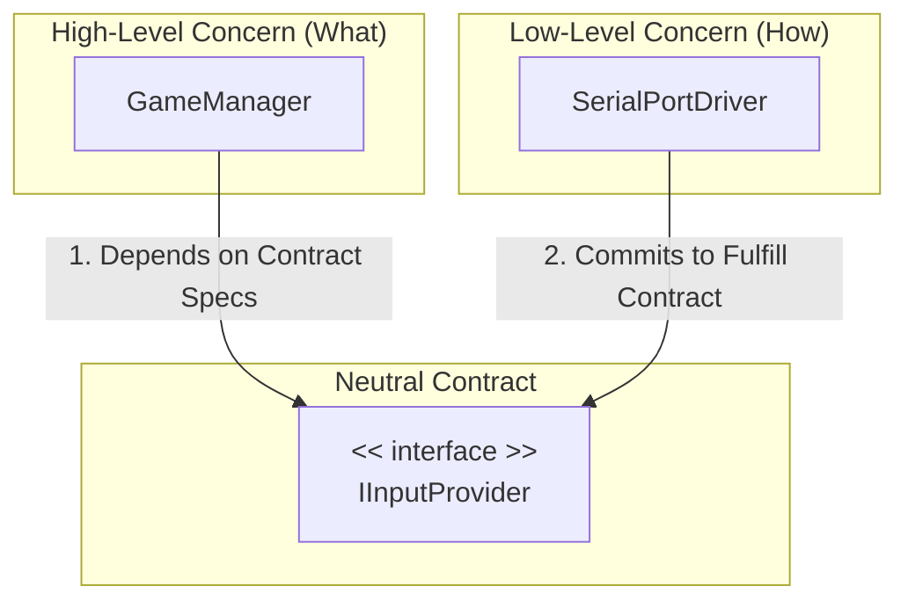

# Dependency is the Art of Software Design

The ultimate goal of software architecture is not to shatter everything into fragments, but to establish a healthy, unidirectional, and stable power structure.

Deciding "who depends on whom" is about clarifying who is the Core Rule (Boss) and who is the Implementation Detail (Runner). We use "Interfaces" as contracts to thoroughly separate the concerns of "What to do (Policy)" from "How to do it (Mechanism)".

## 1. The Golden Rules of Dependency

In Unity architecture, dependency design should follow three golden rules:

### Rule 1: Depend on the "Stable", not the "Volatile"

**Stable:** Core game rules, Data Models, Damage formulas.

**Volatile:** UI layouts, Input hardware, Third-party assets.

**Principle:** UI should depend on Logic, but Logic must never depend on the concrete implementation of UI.

### Rule 2: Depend on "Abstractions", not "Concretions" (DIP & SoC)

This is the essence of Dependency Inversion (DIP), aiming for Separation of Concerns (SoC).

**Concept:** Use an Interface as a neutral Contract.

- **High-Level (User):** Focuses on Business Logic. Depends on the Interface (Defines the Contract).
- **Low-Level (Provider):** Focuses on Implementation Details. Depends on the Interface (Fulfills the Contract).



### Rule 3: Dependencies must be "Unidirectional"

- **Downward Control:** The upper layer holds a reference to the lower layer and commands it directly.
- **Upward Notification:** The lower layer does not know the upper layer exists; it communicates via Events or Return Values.

## 2. The Refined Onion Architecture

Combining MVC and Clean Architecture concepts, we define three layers where dependencies only point inwards.

### Layer 1: Model (Core / Domain) - The Innermost Layer

- **Content:** Pure C# data structures, core rules (PlayerData, DamageFormula).
- **Dependency:** None. It knows nothing about Unity, UI, or who controls it.
- **MVC Role:** Model.

### Layer 2: System (Application Logic) - The Middle Layer

- **Content:** Flow coordinators (GameManager, InventorySystem, InputController).
- **Dependency:** Depends on Model.
- **Responsibility:** Modifies the Model and defines Interfaces needed from the outside world (e.g., IInputProvider).
- **MVC Role:** Controller.

### Layer 3: Adapters (View & Infrastructure) - The Outermost Layer

This layer handles communication with the "External World". It is the "dirty" layer, full of implementation details and easily replaceable.

**View (Presentation / Unity):**

- Depends on Model (to visualize data).
- Notifies System via Events (User Input).

**Infrastructure (Hardware / IO):**

- Depends on Interfaces defined by System (Implementing IInputProvider).

**Key Concept:** Hardware is not the "bottom" foundation; it is a replaceable "plugin".

## 3. Unity Implementation: MVC & Passive View

In Unity, the relationship between Controller and View should follow the Passive View pattern.

### Relationship Definition

- **Controller Depends on View (Solid Line):** The Controller is the Brain; it holds a reference (`[SerializeField]`) to the View to manage its lifecycle (Spawn/Show/Hide).
- **View Does NOT Depend on Controller (Dotted Line):** The View is the Limbs; it does not know the Controller exists. It hands over control via Events.
- **View Depends on Model (Solid Line):** The View subscribes to data changes (UniRx) to update itself.

### Architecture Flow

```mermaid
graph TD
    subgraph "Logic Layer"
        C[Controller]
        M[Model]
    end
    subgraph "Visual Layer"
        V[View]
    end

    %% Control Flow
    C -->|1. Reference & Control| V
    C -->|2. Modify Data| M
    
    %% Data Flow
    V -->|3. Subscribe (UniRx)| M
    
    %% Event Flow
    V -.->|4. Emit User Actions (Event)| C
```

### Code Example

```csharp
// View: Handles display and broadcasting. Unaware of Controller.
public class JumpButtonView : MonoBehaviour
{
    [SerializeField] private Button _btn;
    
    // The Contract: Anyone interested in the jump action subscribes here.
    public IObservable<Unit> OnJump => _btn.OnClickAsObservable();
}

// Controller: Depends on View and Model.
public class PlayerController : MonoBehaviour
{
    [SerializeField] private JumpButtonView _view; // Dependency on View
    [SerializeField] private PlayerModel _model;   // Dependency on Model

    [Inject]
    public void Construct(PlayerModel model) // Injected Model
    {
        _model = model;
    }

    void Start()
    {
        // Binding Logic: When View triggers event -> Execute Controller logic
        _view.OnJump
            .Subscribe(_ => DoJump())
            .AddTo(this);
    }
    
    void DoJump() 
    { 
        // Logic modifies the Model
        _model.Health.Value -= 10; 
    }
}
```

## 4. Practical Patterns & Tools

### A. Dependency Injection (DI) - Solving Structural Coupling

Use frameworks like Reflex or VContainer.

**Best Practice for Race Conditions:** Avoid initializing dependencies in `Awake` or `Start`. Use Method Injection (e.g., a `Construct` method) to ensure dependencies are resolved before logic runs.

### B. Event Strategy - Solving Logical Coupling

How to choose the event delivery mechanism?

| Type | Concept | Use Case | Example |
|------|---------|----------|---------|
| Member Events | Walkie-Talkie | Internal state changes, High Cohesion logic. | `Gun.OnAmmoEmpty` (For UI/Player) |
| Global Event Bus | PA System | Cross-system notification, Sender & Receiver unknown to each other. | `GamePauseEvent` (For Achievements/SaveSystem) |

## 5. Conclusion

The art of software design lies in controlling "Change".

- We let the Controller depend on the View because we want Logic to dictate when screens appear or disappear.
- We ensure the View does not depend on the Controller because we want the UI to be replaceable by artists or reusable in different levels without breaking code.
- We make both sides depend on Interfaces (Infrastructure) so that when hardware changes (Keyboard to Serial Port), the Game Logic remains untouched.

**Remember:** The Core must never depend on the Edge.
